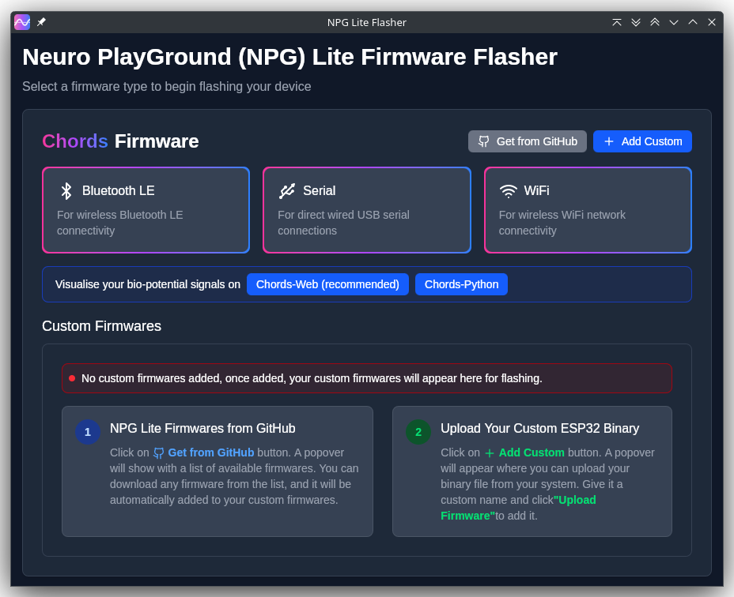

# NPG-Lite-Flasher
Rust based flashing program for NPG Lite.

## Installation Instructions
### Windows  
If you see a warning saying "Microsoft Defender SmartScreen prevented an unrecognized app from starting. Running this app might put your PC at risk," it is likely due to Windows blocking unsigned apps. To bypass this:

1. Click **More Info** on the warning screen.
2. Click **Run Anyway** to continue and install the app.

This will allow the app to run without issues.

## Build instructions

1. `npm i`
2. `cargo tauri build`